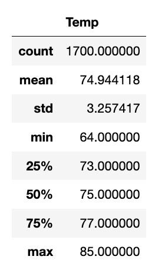
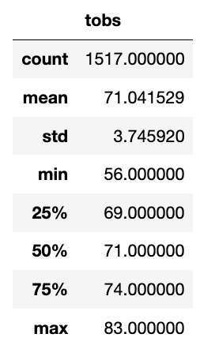

# surfs_up

## Overview

The purpose of this analysis was to provide more information about temperature trends in Oahu before opening up the surf shop. More specifically, we wanted to determine if there was a large difference in temperatures between the months of June and December to see if this business is sustainable year-round. 

## Results

Here are a few differences between the months of June and December in terms of temperature:
1) The mean temperature in June is 3° warmer
2) The maximum temperature is comparable (June = 85, December = 83)
3) The standard deviations are comparable as well with not too high a fluctuation

June Summary Statistics: 

December Summary Statistics: 

## Summary 

Overall, the temperatures for the months of June and December are quite similar in Oahu. This is great news because it means that clients could surf and enjoy ice cream all year round. 

That being said, there are a couple additional queries I would add to enhance the analysis of weather data in Oahu. 
First, I would look at the precipitation differences between the months of June and December. 
Secondly, I would analyze differences between stations to determine if there are inter-station measurement differences in terms of temperature and precipitation. Perhaps one is at a higher elevation and is not representative of where my surf shop would be. 

